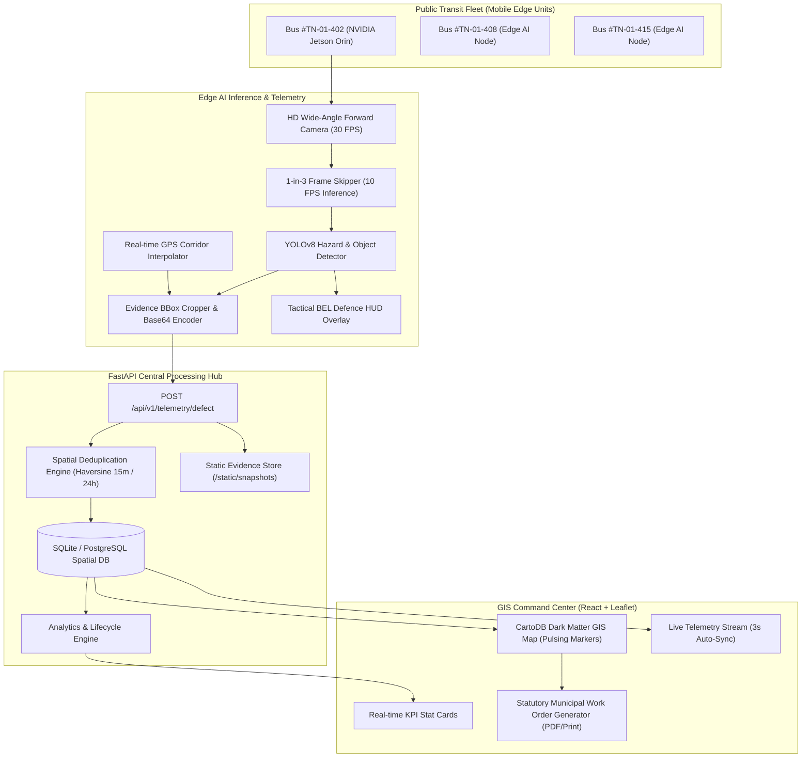

# BHARAT URBAN INTELLIGENCE PLATFORM
### Smart India Hackathon (SIH 2026) | Problem Statement: SIH26124
**Sponsoring Organization:** Bharat Electronics Limited (BEL) & Ministry of Defence  
**Domain:** Smart Automation / Edge AI / Urban Mobility & Defence Dual-Use  

---

## 1. Executive Summary & Problem Overview
Urban municipal corporations struggle with reactive, delayed, and costly road infrastructure surveys. In traditional models, road defects (potholes, structural pavement fissures, missing pedestrian zebra crossings, damaged regulatory signage, and monsoon waterlogging) are only addressed after citizen grievances or catastrophic accidents.

**The Solution:** The **Bharat Urban Intelligence Platform** leverages existing public transit fleets (city buses, transit shuttles) as mobile edge intelligence probes. Equipped with forward-facing high-resolution cameras and low-power edge accelerators (NVIDIA Jetson / BEL Ruggedised Edge Nodes), each bus autonomously inspects road assets in real time, applies spatial deduplication, and streams high-priority hazards directly to municipal repair command centers.

---

## 2. High-Level System Architecture



---

## 3. Key Components & Implementation

### A. Backend & Database Layer (`/backend`)
- **FastAPI Framework:** Asynchronous high-throughput REST API with CORS support.
- **SQLAlchemy ORM (`models.py`):**
  - `RoadDefect`: `id`, `ticket_id`, `defect_type` (pothole, damaged_sign, missing_zebra, waterlogging), `severity` (minor, moderate, critical), `latitude`, `longitude`, `confidence`, `snapshot_url`, `status` (open, under_repair, resolved), `occurrence_count`, `timestamp`, `bus_id`.
  - `VehicleIncident`: `id`, `incident_type` (rash_driving, hit_and_run, bottleneck), `license_plate`, `confidence`, `latitude`, `longitude`, `timestamp`, `bus_id`.
- **Spatial Deduplication Engine (`deduplication.py`):**
  - Employs the **Haversine Great-Circle formula** to measure spatial distance:
    $$\Delta\sigma = 2 \arcsin \left( \sqrt{\sin^2\left(\frac{\Delta\phi}{2}\right) + \cos(\phi_1)\cos(\phi_2)\sin^2\left(\frac{\Delta\lambda}{2}\right)} \right)$$
    $$d = R \cdot \Delta\sigma \quad (R = 6,371,000 \text{ m})$$
  - **Deduplication Logic:** If an incoming defect of identical `defect_type` occurs within **15 meters** of an existing defect recorded in the last **24 hours**, the system does **not** create a duplicate ticket. Instead, it increments `occurrence_count`, updates the timestamp, and recalculates the running moving average confidence score:
    $$\text{Conf}_{\text{new}} = \frac{(\text{Conf}_{\text{old}} \times N) + \text{Conf}_{\text{incoming}}}{N + 1}$$

### B. AI Edge Detection & Telemetry Engine (`/ai_engine`)
- **Script (`video_detector.py`):** Built with `ultralytics` YOLOv8, OpenCV, and threaded async dispatch.
- **Lightweight Inference:** Implements a 1-out-of-3 frame skipping cycle (processes at ~10 FPS inference while maintaining 30 FPS display).
- **Synthetic Urban Dashcam Generator:** Includes a built-in interactive synthetic road stream generator (`--source synthetic`), rendering perspective road geometry, lane markers, moving vehicles, and hazards.
- **GPS Route Simulator:** Automatically simulates travel coordinates along the **Chennai Anna Salai (Mount Road)** transit corridor frame-by-frame.
- **BEL Tactical Defence HUD:** Renders real-time FPS, live GPS coordinates, vehicle speed, heading, node ID, and color-coded corner-bracket reticles (Red for Critical, Amber for Warning, Cyan for Waterlogging).

### C. Frontend GIS Command Center (`/frontend`)
- **React 18 + Tailwind CSS + Lucide React + Leaflet** with dark glassmorphic styling (`slate-950` background, neon cyan/emerald/amber accents).
- **KPI Stat Cards Grid (`StatCards.jsx`):** Total Hazards Logged, Critical Attention Required, Under Repair Active Orders, Resolution Rate, and Deduplication Efficiency Ratio.
- **Interactive GIS Map (`MapView.jsx`):** Dark CartoDB tiles, custom glowing HTML markers with pulsing radar rings, Anna Salai transit corridor route polyline, live fleet bus position markers, and marker detail popups.
- **Live Incident Feed (`IncidentFeed.jsx`):** Auto-polling stream (3-second cadence) with quick filters (All, Critical, Potholes, ANPR) and direct zoom-to-marker integration.
- **Official Statutory Work Order Modal (`WorkOrderModal.jsx`):** Generates a printable municipal work order complete with QR verification code, ticket ID, contractor instructions, IRC safety SLA deadlines, material allocation, and engineer signature blocks.

---

## 4. Quick Start & Execution Guide

### Prerequisites
- Python 3.10+
- Node.js v18+ and npm

### 1-Click Launch (Windows)
Double-click the following scripts or execute them in separate terminals:
1. `start_backend.bat` -> Starts FastAPI backend on `http://localhost:8000`
2. `start_frontend.bat` -> Starts React GIS Command Center on `http://localhost:5173`
3. `run_ai_engine.bat` -> Starts YOLOv8 Edge Detection with synthetic dashcam stream and HUD

### Manual Terminal Commands

#### Step 1: Start Backend API
```powershell
# From project root
python -m uvicorn backend.app:app --host 0.0.0.0 --port 8000 --reload
```
API Documentation will be live at:
- Swagger UI: [http://localhost:8000/docs](http://localhost:8000/docs)
- ReDoc: [http://localhost:8000/redoc](http://localhost:8000/redoc)

#### Step 2: Start Frontend Command Dashboard
```powershell
cd frontend
npm install
npm run dev
```
Dashboard will be live at [http://localhost:5173](http://localhost:5173).

#### Step 3: Run Edge AI Detector
```powershell
# Synthetic dashcam demonstration
python ai_engine/video_detector.py --source synthetic

# Or with a physical webcam
python ai_engine/video_detector.py --source 0

# Or with an MP4 driving video
python ai_engine/video_detector.py --source path/to/dashcam.mp4
```

#### Step 4: Run Automated Verification Test
```powershell
python test_pipeline.py
```

---

## 5. REST API Specification

| Method | Endpoint | Description |
| :--- | :--- | :--- |
| `GET` | `/api/health` | System health and BEL telemetry status |
| `POST` | `/api/v1/telemetry/defect` | Ingests edge hazard telemetry, base64 snapshot, and executes spatial deduplication |
| `GET` | `/api/v1/defects` | Fetches filtered road defect tickets (`defect_type`, `severity`, `status`) |
| `GET` | `/api/v1/analytics/summary` | Aggregated smart city metrics, resolution rates, and deduplication statistics |
| `PATCH` | `/api/v1/defects/{ticket_id}/status` | Updates defect lifecycle (`open` $\to$ `under_repair` $\to$ `resolved`) |
| `POST` | `/api/v1/telemetry/incident` | Ingests ANPR traffic violations and hit-and-run incidents |
| `GET` | `/api/v1/incidents` | Returns live ANPR incident feed |
| `POST` | `/api/v1/seed` | Seeds realistic corridor data for demonstration |

---

## 6. Key Value Proposition for BEL & SIH Judges
1. **Zero Infrastructure Cost:** Utilizes existing public transit fleets rather than expensive dedicated road survey vehicles.
2. **Bandwidth Optimization:** On-device edge inference processes raw video locally; only small telemetry payloads (~350 bytes) and cropped evidence thumbnails are transmitted over 4G/5G.
3. **Overcome Alert Fatigue via Spatial Deduplication:** When 20 buses pass the same pothole throughout the day, municipal workers receive **one consolidated ticket** with a confidence score and occurrence counter—saving up to 85% of redundant administrative overhead.
4. **Dual-Use Defence Synergy:** The platform's forward-looking edge hardware can simultaneously execute convoy route clearance, reconnaissance, and civilian smart-city infrastructure maintenance.
